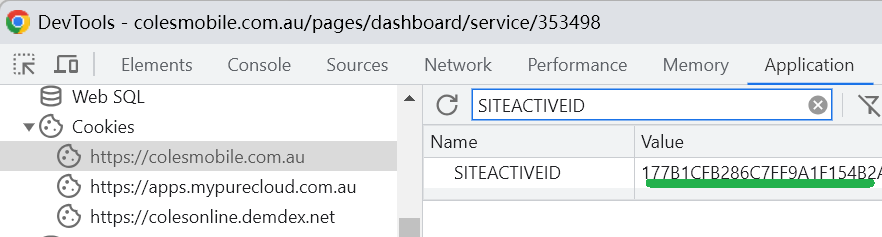

# Collect remaining value of data of my coles mobile

this script will run forever and collect the data usage every hour

## how to install

```
pip install poetry
poetry install
```


## how to set config

1. open and login https://colesmobile.com.au/pages/dashboard/service/
2. click your mobile plan
3. get your server id in the url

https://colesmobile.com.au/pages/dashboard/service/\<server id>

4. get your site active id



5. create a file named config.json and put in your config

```json
{
    "SITEACTIVEID": "xxxxx",
    "SERVERID": "xxxxx"
}
```

## how to run

```
poetry run python app.py
```
